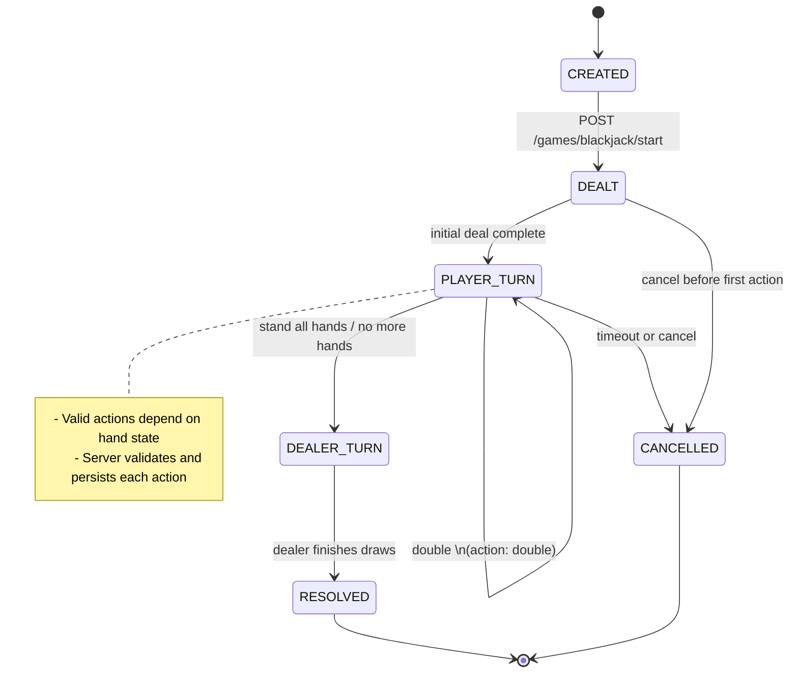
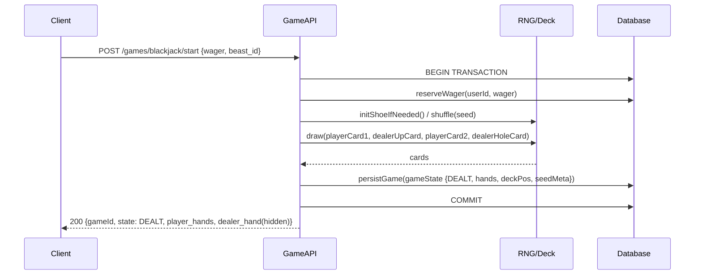
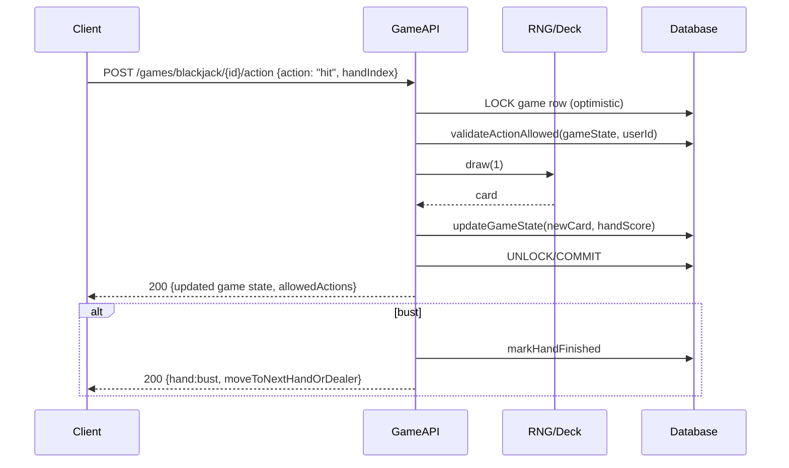
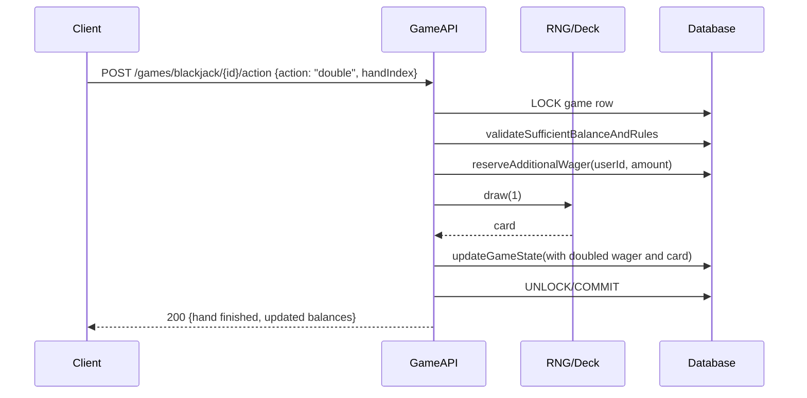

# Blackjack Engine Diagrams

This file contains Mermaid diagrams describing the blackjack engine's finite state machine and common message sequences. Use these for onboarding, design reviews, and deriving QA tests.

## State Diagram



## Sequence Diagrams

Below are representative sequences for common flows. Replace endpoints and field names with your implementation details.

### 1) Start game (deal)



### 2) Player action: Hit



### 3) Player action: Double (one-card then finish)



### 4) Dealer reveal & resolution

```mermaid
sequenceDiagram
    participant API as GameAPI
    participant RNG as RNG/Deck
    participant DB as Database
    participant WAL as TransactionService

    API->>DB: transitionTo(DEALER_TURN)
    API->>RNG: revealHoleCard()
    RNG-->>API: holeCard
    API->>RNG: while dealerScore &lt; 17 draw(1)
    RNG-->>API: card(s)
    API->>DB: computeOutcomes(perHand)
    API->>WAL: applyPayoutsAndRecordTransactions(outcomes)
    WAL-->>DB: balancesUpdated
    API->>DB: persistResolvedState(outcomes, xpAwarded)
    API-->>Client: push/response {state: RESOLVED, outcomes, xp, payout}
```

## Notes on diagrams

- These diagrams are intentionally simplified to show the canonical flows. Real implementations must include error handling, retry, and audit logging sequences.
- Use the sequence flows to derive exact API response shapes and to design E2E tests that replay deterministic seeds.
- The diagrams are stored as text (Mermaid) so they render in VS Code and GitHub and can be updated via PRs.

---

If you want, I can also embed a Mermaid FSM into `docs/BLACKJACK_ENGINE_SPEC.md` itself or generate PNG/SVG exports for team documentation. Which would you prefer?
